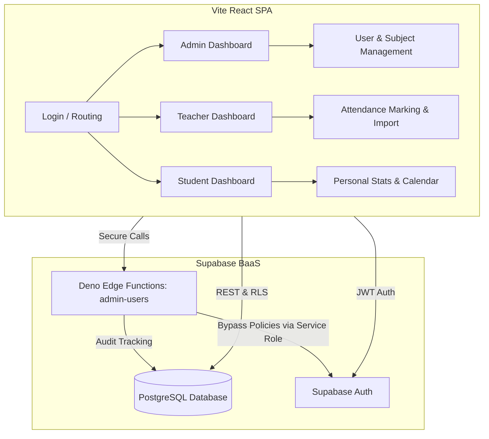
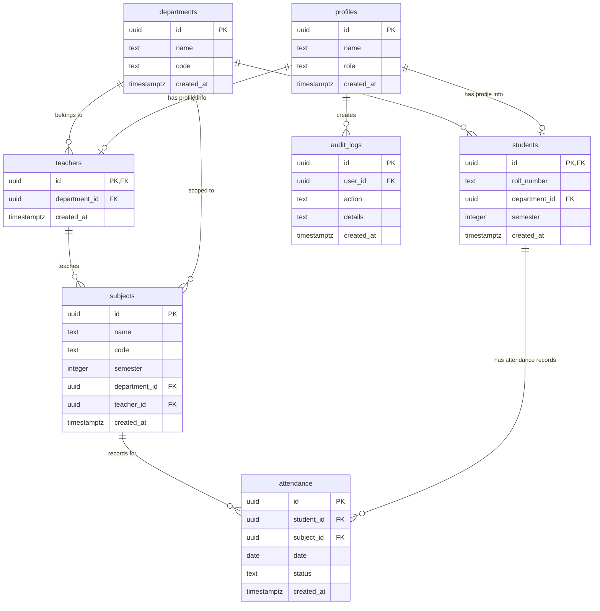

# Student Attendance Management System (SAMS) - Developer Guide

Welcome to the development environment for **SAMS**, a role-based attendance management system. This guide explains the system's architecture, database schema, security rules, and setup steps so you can confidently build, extend, and deploy the application.

---

## 1. System Architecture

SAMS is built using a modern decoupled architecture:



- **Frontend**: React + TypeScript + Vite. It is styled with Tailwind CSS and uses Lucide React for consistent iconography.
- **Backend**: Supabase provides user authentication, PostgreSQL database storage, Row-Level Security (RLS), and secure API endpoints via Deno Edge Functions.

---

## 2. Role-Based Access Control (RBAC)

The system supports three roles, each with custom routing and navigation flows:

1. **Admin**:
   - Manage departments, subjects, teachers, and students.
   - Reset user passwords and delete accounts.
   - View institutional attendance reports.
   - Inspect audit logs tracking database and auth changes.
2. **Teacher**:
   - Mark attendance daily for assigned subjects/semesters.
   - Import attendance via bulk Excel upload.
   - Generate reports on student attendance rates.
3. **Student**:
   - View personal attendance statistics.
   - Inspect a calendar showing historical attendance records.
   - Generate personal semester reports.

---

## 3. Database Schema

The PostgreSQL database contains the following tables and relationships:



### Key Triggers
- **`handle_new_user()`**: An `AFTER INSERT ON auth.users` trigger. It automatically creates a corresponding record in `public.profiles` upon signup. 
  - If no admin exists in the database, the very first signed-up user is automatically promoted to **Admin**.
  - Subsequent users default to the role passed in user metadata, or **Student** if unspecified.

---

## 4. Security & Row-Level Security (RLS)

All database tables have RLS enabled to enforce strict separation of duties:

| Table | SELECT Policy | INSERT/UPDATE/DELETE Policy |
| :--- | :--- | :--- |
| `profiles` | Own profile or Admin only | Own profile update / Admins can update all |
| `departments` | Authenticated users | Admin only |
| `teachers` | Authenticated users | Admin only |
| `students` | Own student profile or Teachers & Admins | Admin only |
| `subjects` | Authenticated users | Admin only |
| `attendance` | Own attendance or Teachers & Admins | Teachers & Admins / Admins only (for DELETE) |
| `academic_years` | Authenticated users | Admin only |
| `audit_logs` | Admin only | Authenticated users (INSERT own) / Admin only (DELETE) |

---

## 5. Deno Edge Functions

Since standard client-side Supabase tokens cannot create, edit, or delete auth users directly without introducing severe security risks, SAMS delegates user lifecycle operations to a Deno Edge Function:

* **Endpoint**: `admin-users` (API path: `/functions/v1/admin-users`)
* **Required Role**: Admin (validated using the sender's JWT).
* **Actions**:
  - `/create` (POST): Provisions new authentication accounts and automatically populates respective `teachers` or `students` profile rows.
  - `/list` (GET): Merges profile data and student/teacher metadata.
  - `/reset-password` (POST): Resets user credentials securely.
  - `/delete/:id` (DELETE): Permanently removes a user from Auth and public profile tables.

---

## 6. Local Setup and Development

Follow these steps to get SAMS running on your computer:

### 1. Prerequisites
- **Node.js**: v18 or later.
- **Supabase CLI**: Required for local database and edge function testing.

### 2. Environment Variables
Create a `.env` file in the root directory:
```env
VITE_SUPABASE_URL=https://your-project-id.supabase.co
VITE_SUPABASE_ANON_KEY=your-anonymous-public-key
```

### 3. Database Initialization
If deploying to a new Supabase project, execute the SQL migration located at:
`supabase/migrations/20260711074224_create_sams_schema.sql`

This can be run via the Supabase Dashboard SQL Editor or by running the CLI migration command:
```bash
supabase db push
```

### 4. Running the Client
Install dependencies and launch the Vite development server:
```bash
# Add node to your PATH if needed, then run:
npm install
npm run dev
```

### 5. Deploying the Edge Function
To deploy the `admin-users` edge function to production, use:
```bash
supabase functions deploy admin-users
```
Make sure you enable the `service_role` functionality and ensure environment variables are correctly injected into your Supabase Dashboard.
